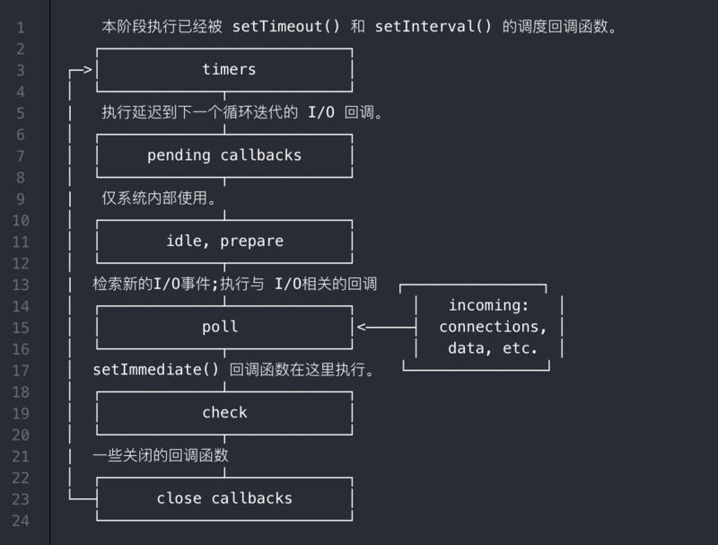

- node的应用场景
```
1 工具类 gulp webpack vite （node可以让js运行在服务器）
2 可以做服务端 优化ssr
3 可以做中间层 （解决跨域问题，格式化数据）
```

- 性能
```
非阻塞
异步I/O（当这个方法调用完毕后不会立即返回结果）
事件驱动（发布订阅模式）
```

- 优势
```
在Java、PHP或者.NET等服务器语言中，会为每一个客户端连接创建一个新的线程。而每个线程需要耗费大约2MB内存。也就是说，理论上，一个8GB内存的服务器可以同时连接的最大用户数为4000个左右。要让web应用程序支持更多的用户，就需要增加服务器的数量，而web应用程序的硬件成本当然就上升了。

NodeJs不为每个客户连接创建一个新的线程，而仅仅使用一个线程。当有用户连接了，就触发一个内部事件，通过非阻塞I/O、事件驱动机制，让Node.js程序宏观上也是并行的。使用Node.js，一个8GB内存的服务器，可以同时处理超过4万用户的连接。
```


- node的全局对象和模块
```
1、global

global是全局对象，可以直接访问里面的属性
里面有：
Buffer
process
setInterval,setTimeout,setImmediate
console
queueMicrotask

2、模块
__dirname
__filename
exports
module
require()

3、process常用属性或方法

process.platform 系统
process.kill 杀进程
process.exit 退出进程
process.nextTick node中的微任务 当前执行栈的底部 优先级比promise高
process.cwd() 当前的工作目录,是可变的，看命令在哪里执行 （__dirname当前文件所在的文件夹，此路径不会发生变化）
process.env 环境变量（可以set，例如process.env.NODE_ENV）
process.argv 执行时所带的参数
```

- 事件环机制

```
重要的三个阶段
timer 存放定时器
poll 轮询处理I/O回调
check setImmediate
如果在 I/O 回调的方法里，setImmediate优先于 timer 执行
应为 poll 接下来是 check

nextTick 算是一个微任务，不在事件环中
在node 11 以上 宏任务与微任务的执行顺序与浏览器一样
```

- Buffer
```
JavaScript 语言自身只有字符串数据类型，没有二进制数据类型。

但在处理像TCP流或文件流时，必须使用到二进制数据。因此在 Node.js中，定义了一个 Buffer 类，该类用来创建一个专门存放二进制数据的缓存区。在 Node.js 中，Buffer 类是随 Node 内核一起发布的核心库。Buffer 库为 Node.js 带来了一种存储原始数据的方法，可以让 Node.js 处理二进制数据，每当需要在 Node.js 中处理I/O操作中移动的数据时，就有可能使用 Buffer 库。原始数据存储在 Buffer 类的实例中。一个 Buffer 类似于一个整数数组，但它对应于 V8 堆内存之外的一块原始内存。Buffer属于global上的属性可以直接被访问，读取文件，写入（二进制）从硬盘中读取的数据都存到内存上，
buffer可以和字符串相互转化
定义buffer的三种方式

let buf1 = Buffer.alloc(6);
let buf2 = Buffer.from('珠峰');
let buf3 = Buffer.from([65,66,67]);

buffer中常用的方法

buff.toString()
buff.fill()
buff.slice()
buff.copy
Buffer.concat()
Buffer.isBuffer()
indexOf
```

